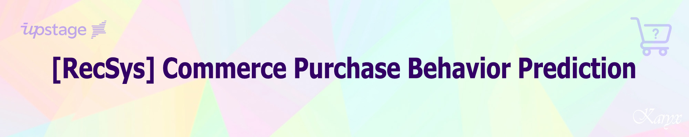

## **💻 Project Overview**
### Environment
- **OS:** Linux Ubuntu 20.04.6 LTS
- **System Memory:** 256GB RAM
- **Computing Power:** 24-Core / 48-Thread Multi-core CPU
- **GPU:** NVIDIA GeForce RTX 3090 (24GB VRAM)
- **NVIDIA Driver Version:** 535.86.10
- **CUDA Version:** 12.2 (Runtime: 11.8)
- **Tool:** VS Code (SSH), Google Colab
- **Language:** Python 3.10.13

### Requirements
```
catboost==1.2.10                                  pandas==2.1.4
fastparquet==2026.3.0                             pyarrow==24.0.0
implicit==0.7.2                                   ray==2.6.3
kmeans_pytorch==0.3                               recbole==1.2.1
lightgbm==4.6.0                                   tqdm==4.66.1
numpy==1.26.2                                     xgboost==3.2.0
```

---

## **📋 Competition Info**
### 커머스 상품 구매 예측 (Commerce Purchase Behavior Prediction)
- 사용자의 쇼핑 패턴을 분석해서 각 사용자에게 미래(next one week)에 구매 가능성 높은 상위 10개 아이템 추천
- 이커머스 분야에서 추천 시스템은 사용자의 취향을 분석하여 알맞은 상품을 추천함으로써 사용자의 경험을 증진하고 기업의 매출 향상에 도움을 줄 수 있음

### 일정 (Timeline): 개인 출전 허용
- 2026.05.04 09:00 ~ 2026.05.14 18:00 (Competition)
- 2026.05.15 17:00 ~ 2026.05.15 18:30 (Seminar)

### 데이터셋 정보 (Dataset Info)
- eCommerce behavior data from multi category store 데이터를 전처리하여 사용
- 학습데이터: 2019년 11월 1일부터 2020년 2월 29일까지 4개월간 데이터 (8,350,311건)
- 평가데이터: 2020년 3월 1일부터 2020년 3월 7일까지 일주일간 데이터 (6,382,570건)
- cold-start scenario 고려하지 않음: 편의상 train set에 있는 user_id, item_id만 남기고 제거

### 평가지표 (Evaluation Metric)
- NDCG@10: Relevance는 ground-truth set에 따라 1(실제 구매) 0은(구매 안함)으로 나눠짐 (binary relevance)<br>
  즉, 평가데이터의 해당 user가 실제로 구매했으면 1, 아니면 0
- NDCG@10값이 클수록 또는 NDCG@10값이 동일하다면 제출횟수가 적을수록, 높은 순위로 인정
- 평가데이터는 무작위(50:50 random split)로 public testset과 private testset으로 나뉨
- 최종 순위는 private LB를 기반으로 함
- 평가 예시: Most popular Top 10
> 학습데이터에서 가장 많이 구매된 item을 추천<br>
> 모든 user_id에 동일한 10개의 item으로 구성 (비개인화 추천)

### 규정 (Rule)
- 외부 데이터셋 사용 금지
- 사전 학습된 가중치 가져오는 행위 금지

---

## **💾 Data Description**
### EDA (Exploratory Data Analysis)
#### 1. Property Description
- user_id: Permanent user ID
- item_id: ID of a product
- user_session: Temporary user's session ID. Same for each user's session. Is changed every time user come back to online store from a long pause.
- event_time: Time when event happened at (in UTC)
- category_code: Product's category taxonomy (code name) if it was possible to make it. Usually present for meaningful categories and skipped for different kinds of accessories.
- brand: Down-cased string of brand name. Can be missed.
- price: Float price of a product. Present.
- event_type: Only one kind of event - purchase

#### 2. 사용자 행동 기록
- 사용자는(user_id)는 홈페이지에 들어가 세션(user_session)을 할당받고 특정 아이템(item_id)을 특정 시간(event_time)에 상품(product_id) 장바구니에 추가(event_type='cart')하거나 조회(event_type='view')하거나 구매(event_type='purchase')할 수 있음
- 각 상품별로 (해당 시점에 따른) 카테고리 코드(category_code)와 브랜드(brand), 가격(price)이 주어짐

#### 3. submission.csv: 다음 일주일 동안 사용자가 구매한 상품 예측
- 구매한 (event_type='purchase') 상품의 예측이 목적
- 제출 파일은 user_id, item_id로 구성, user_id 당 top 10개의 item_id를 정렬해서 구성해야 함 (predicted score 기준으로 item_id가 내림차순 정렬되어 있어야 함)
- 학습데이터에 포함된 모든 user에 대해서 예측을 진행하므로, 해당 파일은 총 6,382,570(638,257명의 user에게 10건씩) row로 구성되고 모든 유저에게 10건씩 중복 없이 item을 추천해야만 채점이 진행

#### 4. 기초 통계량
> interactions: 8,350,311<br>
> unique users: 638,257<br>
> unique items: 29,502<br>
> unique sessions: 2,889,552<br>
> category codes: 24<br>
> brands: 1,859

#### 5. 이벤트 타입
- 데이터 희소성 99.96%로 구매는 전체의 0.02% 밖에 안됨
> view: 8,331,873 (99.78%)<br>
> cart: 16,362 (0.20%)<br>
> purchase: 2,076 (0.02%)

#### 6. View2Cart, View2Purchase, Cart2Purchase Rates
- 장바구니에 담으면 12.68% 확률로 구매하므로 cart 이벤트가 강력한 구매 신호
> View2Cart rate: 0.0019<br>
> View2Purchase rate: 0.0002<br>
> Cart2Purchase rate: 0.1268

#### 7. 유저별 상호작용 분포
> 평균: 13.08회 / 중앙값: 6회 / 최대: 37,207회<br>
> 5회 미만 상호작용 유저: 268,279명 (42.03%)<br>
> cold start 문제: 42%의 유저가 필터링됨 (SASRec 학습시 이 유저들이 제외됨)
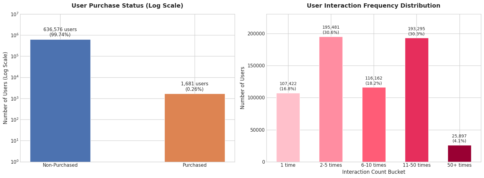

#### 6. 시간에 따른 이벤트
> 주말(토, 일) 상호작용이 가장 많지만 목요일에 구매 전환율이 특이하게 높음 (0.072%)
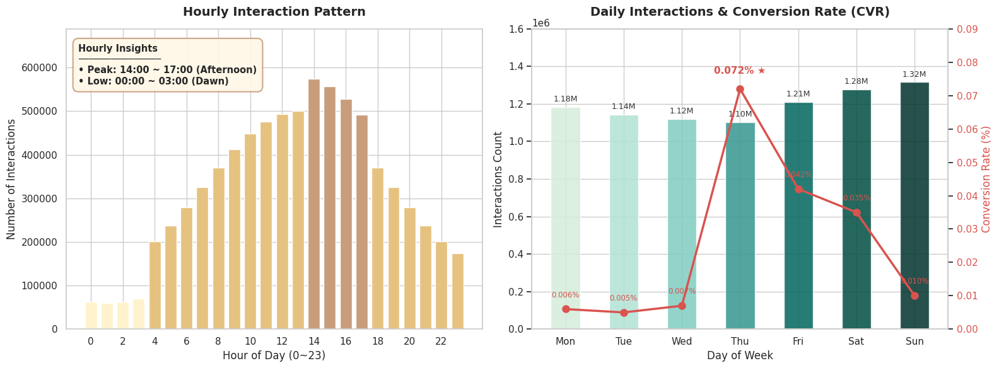

#### 7. 카테고리와 브랜드
- 모든 데이터가 의류(apparel) 카테고리이므로 카테고리 정보는 차별화에 도움 안됨
> 메인 카테고리: 1개 (apparel만 존재)<br>
> 서브 카테고리: 24개

#### 8. 조회 인기 브랜드 vs 구매 인기 브랜드
- 구매 수가 너무 적어 브랜드가 큰 의미는 없어 보임 (최대 224개)
> `respect`는 조회 1위지만 구매는 5위: 구경만 많이 함<br>
> `xiaomi`, `sony`, `samsung`이 실제 구매로 이어지는 브랜드<br>
> `iqos`, `glo` 같은 전자담배가 구매 상위에 있음
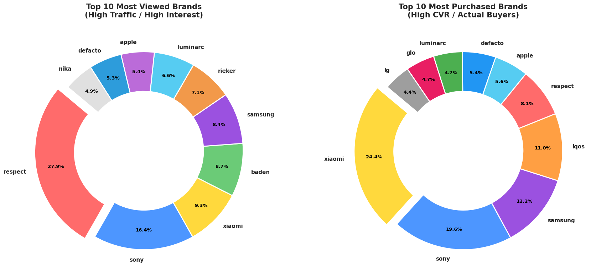

#### 9. 아이템별 상호작용 통계
> long-tail 분포: 상위 10% 아이템이 전체 상호작용의 63.4%를 차지
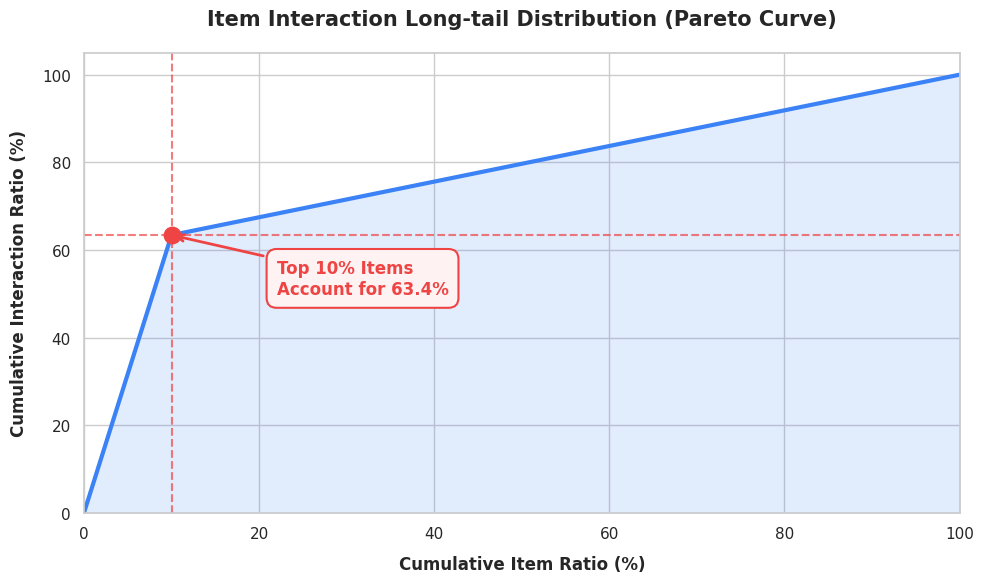
> 전체 아이템: 29,502개<br>
> 구매된 아이템: 996개 (3.38%)<br>
> 구매안된 아이템: 28,506개 (96.62%)

#### 10. 가격 통계
> 대부분 가격은 500이하로 책정되어 있으며, 구매된 상품의 가격이 더 낮음<br>
> $0-50 가격대가 구매 전환율 가장 높음
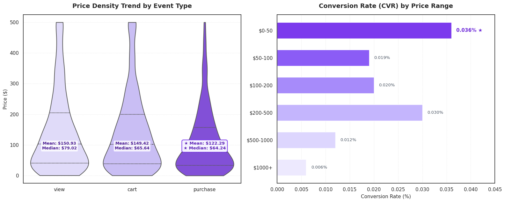

#### 11. 문제점 요약
| 문제 | 심각도 | 영향 | 개선 방향 |
| :--- | :--- | :--- | :--- |
| 구매 데이터 부족 (0.02%) | 🔴 심각 | 학습 신호 부족 | 이벤트 가중치 |
| cold start (42%) | 🔴 심각 | 점수 동일 원인 | 필터링 완화 |
| long-tail (63%) | 🟡 중간 | 다양성 부족 | 인기도 조절 |
| 희소성 (99.96%) | 🟡 중간 | 협업필터링 한계 | 하이브리드 모델 |
| 카테고리 무의미 | 🟢 낮음 | 특징 손실 | 무시 가능 |

### Data Preprocessing

---

## **🧠 Modeling**
### Model Description
#### 1. ALS (Alternating Least Squares)
- 행렬 분해(Matrix Factorization) 기반: 사용자-아이템 상호작용 행렬을 두 개의 저차원 잠재 요인(latent factor) 행렬로 분해하여 빈 공간을 예측하는 전통적인 협업 필터링 알고리즘
- 효율적인 병렬 처리: 사용자 행렬과 아이템 행렬을 번갈아 가며 최적화하는 방식을 취하므로, 거대한 데이터셋에서도 분산 처리가 가능하여 대규모 서비스에 유리
- 희소 데이터 대응: 상호작용이 적은 데이터셋에서도 잠재 요인을 통해 의미 있는 추천을 생성하며, implicit feedback(클릭, 시청 시간 등) 데이터를 처리하는 데 강점이 있음
- 한계점: 정적인 취향 파악에는 능숙하지만, 사용자의 실시간 관심사 변화나 아이템 소비 순서와 같은 순차적 맥락 반영은 어려움

#### 2. SASRec (Self-Attentive Sequential Recommendation)
- Self-Attention 메커니즘: Transformer 구조를 추천 시스템에 도입하여, 사용자의 과거 활동 중 현재의 선택에 가장 큰 영향을 준 특정 시점의 이벤트를 동적으로 파악
- 순차적 맥락 파악: 사용자의 최근 소비 트렌드와 장기적인 취향을 동시에 학습하며, 시간 흐름에 따른 아이템 간의 인과 관계를 효과적으로 모델링
- 병렬 학습의 이점: RNN 기반 모델(GRU4Rec 등)과 달리 전체 시퀀스를 한 번에 처리할 수 있어 학습 속도가 빠르고 긴 이력도 안정적으로 처리
- 복잡한 패턴 학습: 수많은 아이템 중에서 사용자가 다음에 선택할 아이템을 예측하는 next-item prediction 태스크에서 매우 높은 정확도를 보임

#### 3. LightGBM
- Leaf-wise 트리 분할: 트리의 균형을 맞추기보다 손실(loss)을 최대화하는 잎 노드를 우선적으로 분할하여, 더 깊은 트리를 형성하고 정확도를 높이는 구조
- GOSS & EFB 알고리즘: 데이터 샘플 수를 줄이고 변수를 묶는 기법을 통해, 메모리 사용량을 획기적으로 줄이면서도 대규모 정형 데이터(tabular data)를 매우 빠르게 학습
- 범주형 변수 최적화: 별도의 one-hot encoding 없이도 범주형 feature를 직접 처리할 수 있어, 추천 시스템의 메타 데이터(성별, 지역, 카테고리 등) 활용 시 성능이 뛰어남
- 속도와 성능의 균형: XGBoost 대비 학습 속도가 압도적으로 빠르며, 하이퍼파라미터 튜닝에 따라 매우 정교한 순위 예측 가능

#### 4. XGBoost
- Level-wise 트리 분할: 트리의 층을 유지하며 균형 있게 성장시켜 과적합에 강하며, 안정적인 성능을 보장하는 전통적인 gradient boosting 프레임워크
- 정교한 규제(regularization): L1, L2 규제를 내장하고 있어 복잡한 데이터에서도 모델의 일반화 성능이 뛰어나며, 시스템 자원을 효율적으로 사용하여 결측치를 스스로 처리함
- 신뢰도 높은 앙상블: 여러 개의 약한 의사결정 트리를 결합하여 잔차를 줄여나가는 방식으로, 정형 데이터 예측 대회나 실무 지표 최적화에서 검증된 성능을 보유
- 병렬 및 분산 학습 지원: 가중치 분위수 스케치(weighted quantile sketch) 등을 통해 대량의 수치형 feature를 효율적으로 계산하며 정확한 결과 도출에 유리

#### 5. CatBoost (Categorical Boosting)
- 독자적인 범주형 변수 처리: Ordered TS(Target Statistics) 방식을 사용하여 범주형 피처를 수치화할 때 발생할 수 있는 데이터 누수를 방지하고, 전처리 과정을 대폭 단순화
- Symmetric Tree 구조: 트리의 모든 레벨에서 동일한 분할 조건을 사용하는 대칭 트리 구조를 채택하여 예측 속도가 매우 빠르며, 모델의 과적합을 효과적으로 억제
- 신뢰도 높은 기본 성능: 하이퍼파라미터 튜닝에 민감한 다른 부스팅 모델들과 달리, 기본 설정값만으로도 최상위권의 정확도를 보여 실무 및 대회에서 생산성이 높음
- 정렬된 부스팅(ordered boosting): 학습 데이터의 순서를 섞어 잔차를 계산하는 방식을 통해 작은 데이터셋에서도 일반화 성능이 뛰어나며, 추천 시스템의 리랭킹 단계에서 복잡한 변수 간의 관계를 안정적으로 학습

### Modeling Process
#### 1. ALS
```
python train_als.py  # train & inference
```

#### 2. SASRec
```
python recbole_dataset.py  # prepare datset for using Recbole library
python train_sasrec.py  # SASRec train
python inference_sasrec.py --model_file ./checkpoints/SASRec-####.pth  # SASRec infrence
```

#### 3. LightGBM / XGBoost / CatBoost & ensemble (파일명 모델에 맞게 변경)
```
python make_candidates.py --model_file checkpoints/SASRec-####.pth --k 200 --out output/candidates.parquet
python train_rerank.py --candidates output/candidates.parquet --model_out output/rerank.txt
python inference_ensemble.py --candidates output/candidates.parquet --lgbm_model output/rerank.txt --out output/ensemble.csv --w_lgbm 0.X --w_sasrec 0.X
python inference_ensemble.py \
  --candidates     output/candidates_xgb.parquet \
  --xgb_model      output/rerank_xgb.json \
  --lgbm_model     output/rerank_lgbm.txt \
  --catboost_model output/rerank_catboost.cbm \
  --out            output/submission.csv \
  --w_xgb 0.X --w_lgbm 0.X --w_catboost 0.X
```

#### 4. 앙상블 전략
- SASRec 단독(0.1168) → LightGBM 단독: 순차 패턴 모델이 의외로 강력
- 각 모델 점수를 min-max 정규화 후 가중합: 스케일 불일치 해소
- negative sampling(유저당 50개)으로 학습 속도 대폭 개선 + 과적합 완화

---

## **🕵️‍♀️ Hypothesis Notes**

---

## **💡 Insights from Trial and Error**

---

## **📊 Experiment Logger**
> 실험기록이 많으므로 주요 변화 건만 기재
<table>
  <thead>
    <tr>
      <th>NO.</th>
      <th>DATE</th>
      <th>MODEL</th>
      <th>KEY CHANGES</th>
      <th>PUBLIC</th>
      <th>PRIVATE</th>
    </tr>
  </thead>
  <tbody>
    <tr>
      <td align="center">22</td>
      <td align="center">20260514</td>
      <td>LightGBM + XGBoost + CatBoost</td>
      <td>ensemble (가중치 조절)</td>
      <td align="center"><b>0.1459</b></td>
      <td><b>0.1459</b></td>
    </tr>
    <tr>
      <td align="center">21</td>
      <td align="center">20260514</td>
      <td>LightGBM + XGBoost + CatBoost</td>
      <td>3-model ensemble</td>
      <td align="center"><b>0.1454</b></td>
      <td><b>0.1454</b></td>
    </tr>
    <tr>
      <td align="center">12</td>
      <td align="center">20260514</td>
      <td>XGBoost + SASRec</td>
      <td>ensemble</td>
      <td align="center"><b>0.1371</b></td>
      <td><b>0.1367</b></td>
    </tr>
    <tr>
      <td align="center">09</td>
      <td align="center">20260511</td>
      <td>LightGBM + SASRec</td>
      <td>ensemble</td>
      <td align="center"><b>0.0994</b></td>
      <td><b>0.1000</b></td>
    </tr>
    <tr>
      <td align="center">07</td>
      <td align="center">20260511</td>
      <td>SASRec</td>
      <td>full eval, 19 epoch</td>
      <td align="center"><b>0.1168</b></td>
      <td><b></b>0.1172</td>
    </tr>
    <tr>
      <td align="center">06</td>
      <td align="center">20260510</td>
      <td>ALS</td>
      <td>개선 버전</td>
      <td align="center"><b>0.0862</b></td>
      <td><b>0.0857</b></td>
    </tr>
    <tr>
      <td align="center">04</td>
      <td align="center">20260508</td>
      <td>SASRec</td>
      <td>hyperparameter tuning</td>
      <td align="center"><b>0.1155</b></td>
      <td><b>0.1158</b></td>
    </tr>
    <tr>
      <td align="center">03</td>
      <td align="center">20260507</td>
      <td>SASRec</td>
      <td>baseline code (1 epoch)</td>
      <td align="center"><b>0.0861</b></td>
      <td><b>0.0857</b></td>
    </tr>
    <tr>
      <td align="center">02</td>
      <td align="center">20260507</td>
      <td>ALS</td>
      <td>bseline code</td>
      <td align="center"><b>0.0843</b></td>
      <td><b>0.0849</b></td>
    </tr>
  </tbody>
</table>

---

## **🚀 Result**
### Champion Model Info
- **Version:** V22 (LightGBM + XGBoost + CatBoost ensemble)
- **Training Time:** 9h 4m
- **Accuracy (Public / Private):** 0.1459 / 0.1459

### Leaderboard Rank: No. 1 (Solo Entry) 🏆 [mid: 0.1459 / final: 0.1459]
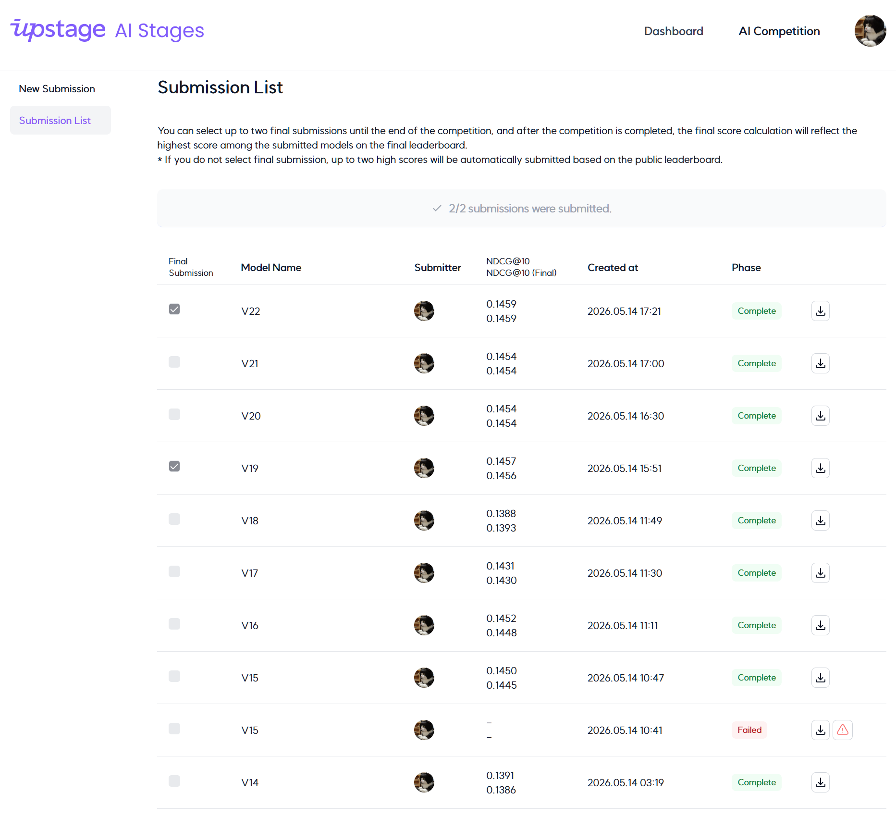
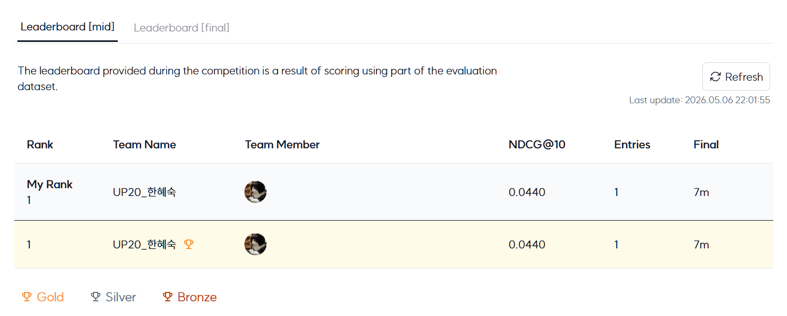
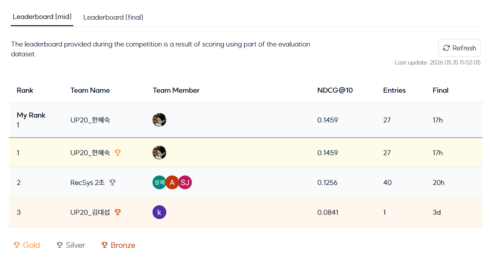
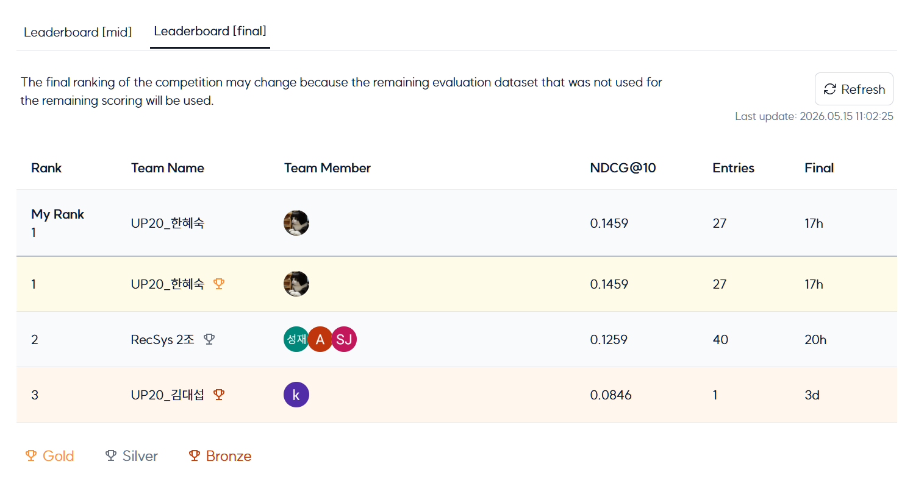

---

## **📜 Version Log**
[[Releases] Download Source Code for Each Version](https://github.com/karmakaryx/cv-document-type-classification/releases)

---

## **⚙️ Components**
### Workflow (using Mermaid Markdown)
2-Stage Pipeline: Candidate Generation → Learning-to-Rank
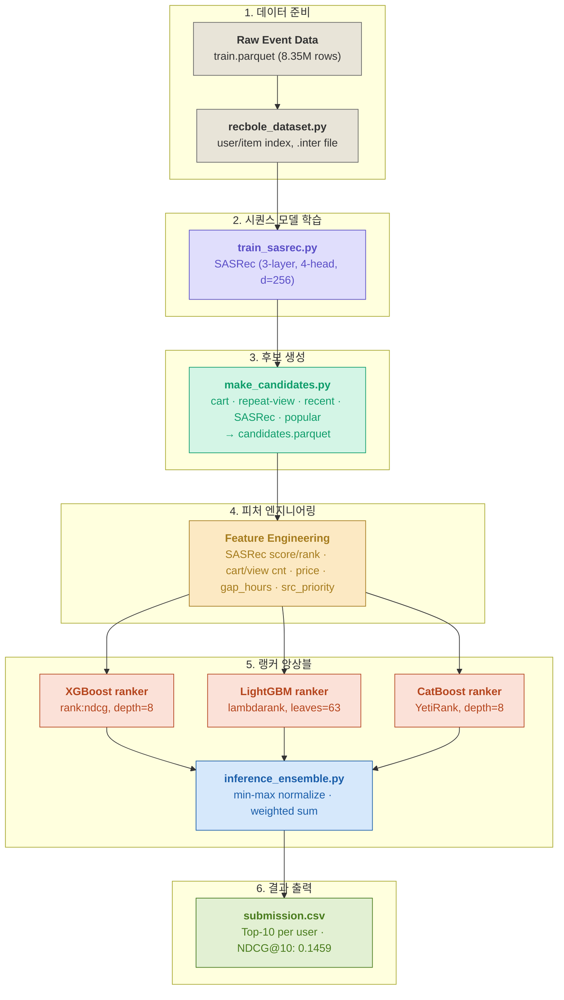

### Directory
```
├── assets/...                       # README images
├── code/
│   ├── catboost_info/...            # CatBoost 실행시 자동 생성 (GitHub 관리 제외)
│   ├── checkpoints/                 # (GitHub 관리 제외)
│   │   └── SASRec-####.pth          # 학습된 모델 가중치 저장
│   ├── config/                      # 모델 및 학습 하이퍼파라미터 설정
│   │   └── sasrec.yaml
│   ├── logs/                        # 일반 로그 및 평가지표 저장 (GitHub 관리 제외)
│   │   ├── SASRec/...
│   │   └── sasrec_metrics.csv
│   ├── log_tensorboard/             # 학습 프로세스 시각화용 로그 (GitHub 관리 제외)
│   │   └── model-####/...
│   ├── output/                      # 추론 결과 및 리랭킹 모델 파일 저장 (GitHub 관리 제외)
│   │   ├── candidates_lgbm.parquet
│   │   ├── candidates_xgb.parquet
│   │   ├── rerank_catboost.cbm
│   │   ├── rerank_lgbm.txt
│   │   └── rerank_xgb.json
│   ├── inference_ensemble_lgbm.py   # LightGBM 기반 앙상블 추론
│   ├── inference_ensemble_xgb.py    # XGBoost 기반 앙상블 추론
│   ├── inference_ensemble.py        # 전체 모델 앙상블 메인 스크립트
│   ├── inference_sasrec.py          # SASRec 단일 모델 추론
│   ├── make_candidates_lgbm.py      # LGBM용 후보군 생성
│   ├── make_candidates_xgb.py       # XGB용 후보군 생성
│   ├── recbole_dataset.py           # RecBole 프레임워크용 데이터 로더
│   ├── train_als.py                 # ALS 모델 학습
│   ├── train_rerank_catboost.py     # CatBoost 리랭킹 모델 학습
│   ├── train_rerank_lgbm.py         # LightGBM 리랭킹 모델 학습
│   ├── train_rerank_xgb.py          # XGBoost 리랭킹 모델 학습
│   ├── train_sasrec.py              # SASRec 모델 학습
│   └── utils.py                     # 공통 유틸리티 함수
├── data/                            # (GitHub 관리 제외)
│   ├── SASRec_dataset/              # SASRec 전용 인터랙션 데이터
│   │   └── SASRec_dataset.inter
│   ├── item2idx.json                # item_id 매핑 테이블
│   ├── sample_submission.csv        # 제출파일 template
│   ├── train.parquet                # 학습데이터
│   └── user2idx.json                # user_id 매핑 테이블
├── .gitignore
├── README.md
└── requirements.txt
```

---

## **🛠️ etc.**
### Reference
- [[Kaggle] eCommerce behavior data from multi category store](https://www.kaggle.com/datasets/mkechinov/ecommerce-behavior-data-from-multi-category-store/data)
- [REES46 for eCommerce](https://rees46.com/)
- [[Wikipedia] Discounted Cumulative Gain](https://en.wikipedia.org/wiki/Discounted_cumulative_gain)
- [[PDF] LightGBM: A Highly Efficient Gradient Boosting Decision Tree](https://proceedings.neurips.cc/paper_files/paper/2017/file/6449f44a102fde848669bdd9eb6b76fa-Paper.pdf)
- [[Docs] XGBoost Documentation](https://xgboost.readthedocs.io/en/release_3.2.0/)

### Role & Project Management
- **역할:** ✨TEAM SOLO✨ 1인분 됩니다 (팀장, 팀원, 개발 & 실험, 산출물, 발표)
- **협업방식:** 자작 실험관리툴 KattPaw 활용, 코드 카오스 최소화
- **기여도 (100%):** 독고다이 일당백
- **전략 및 성과:** 마지막 대회이므로 조금 욕심내서 2개 대회 동시 참여 신청. 난이도가 높은 OCR 대회에 비중을 더 두고, 본 RecSys 대회는 초기 EDA에서 유의미한 데이터의 비율이 매우 낮은 것을 확인한 뒤 Local CV 전략 등은 포기하고 실험 횟수를 줄이기로. 대신 ML대회에서 결과가 좋았던 SOTA 모델들을 조기 투입하여 성능을 높임. 최종적으로, 두 대회 모두 1위로 미션 클리어, 유종의 미를 거두다.✌️

### Project Retrospective
개인 출전으로 동시에 2개 대회를 참여했기 대문에 1대의 GPU 스케줄링을 위해 24시간 대기하는게 힘들었습니다. OCR은 computer vision 특성상 학습시간이 길고, RecSys는 CPU를 주로 사용한다고 해도 대용량 데이터다 보니 메모리 점유율이 높아 동시 진행은 힘들거라 예상됐지만 그래도 혹시나 2개 모델을 동시에 돌릴 수 있는지 시도해봤는데, 되겠냨ㅋㅋㅋㅋ 그래서 열흘 동안 잠은 학습이 끝날 시간에 알람 맞춰놓고 중간중간 잤는데, 자고 일어나보면 loss가 터져있어서 몇 시간씩 날린 적도 있고..🥲<br>
RecSys쪽이 2지망이어서 W&B 등의 CV 환경을 제대로 구축하지 못한 점이 아쉽습니다. 좀 더 다양한 실험에 대한 계획은 있었으나 대부분 실행에 옮길 물리적인 시간이 부족했네요. 팀으로 참여했다면 팀원 분의 GPU를 동원하는 방법도 있었을텐데, 혼자서 2개 대회 하는 것은 비추합니다. 2개 대회 모두 단독 1등하긴 했지만 몸 생각해서 이런 무모한 시도는 하지 마세요. (AI가 인간을 완전히 대체하는 아포칼립스까지) 오래 살면서 개발해야죠ㅎㅎ🥹

<br>
